# edge_detection_ZYNQ

## 概述

主要实现的是基于Zynq的图像边缘检测系统，采用Zynq作为主要的硬件开发平台，ARM处理器完成系统运行和数据交换，FPGA 部分实现硬件扩展和图像处理算法。采用软硬件协同设计的方法，完成嵌入式图像处理系统的设计。相比于传统的图像边缘检测系统，基于Zynq SOC 的嵌入式系统不仅提高了图像的检测质量，而且具有实时性和可扩展性好的优点。

## 平台介绍

由 Xilinx 公司推出的 Zynq-7000 是一款兼具高性能与低功耗的可编程片上系统架构，为边缘检测系统的研发与设计提供了灵活平台Zynq-7000 内部架构包括全功能的多核处理器系统（Processing System，PS）和高性能可编程逻辑 FPGA 系统（Programble Logic，PL）两个部分，集 ARM Cortex-A9 双核处理器和高性能 FPGA 于一体，可以利用 ARM 处理器控制程序方面的优势以及 FPGA 现并行计算的特点来实现智能相机处理算法的硬件加速，并且能够提高算法的可配置程度，具有功耗低和设计灵活性高的优点。 

本次采用Zynq7000开发平台AX7020，具体型号为XC7Z020-2CLG400I，开发板结构图如图1和2所示，在AX7020 开发板上，ZYNQ7000 的PS部分和PL 部分都搭载了丰富的外部接口和设备，方便用户的使用和功能验证。另外开发板上集成了Xilinx USB Cable 下载器电路，用户只要用一个USB 线就可以对开发板进行下载和调试。

如图2 结构示意图所示，开发平台包含的接口和功能有：

（1）+5V 电源输入,最大2A 电流保护；

（3）两片大容量的4Gbit（共8Gbit）高速DDR3 SDRAM,可作为ZYNQ 芯片数据的缓存，也可以作为操作系统运行的内存;

（4）一片256Mbit 的QSPI FLASH, 可用作ZYNQ 芯片的系统文件和用户数据的存储;

（5）一路HDMI 图像视频输入输出接口, 能实现1080P 的视频图像传输；

（6）一路高速USB2.0 HOST接口, 可用于开发板连接鼠标、键盘和U盘等USB外设;

（7）一路高速USB2.0 OTG接口, 用于和PC或USB设备的OTG通信;

（8）一路USB Uart接口, 用于和PC或外部设备的串口通信;

（9）板载一个33.333Mhz的有源晶振，给PS系统提供稳定的时钟源，一个50MHz的有源晶振，为PL逻辑提供额外的时钟；

（10）2路40针的扩展口（2.54mm间距），用于扩展ZYNQ的PL部分的IO。可以接7寸TFT模块、摄像头模块和AD/DA模块等扩展模块；

（11）一个12针的扩展口（2.54mm间距），用于扩展ZYNQ的PS系统的MIO；

## 算法说明

边缘检测是图像处理与计算机视觉中极为重要的一种分析图像的方法，边缘检测的目的就是找到图像中亮度变化剧烈的像素点构成的集合，表现出来往往是轮廓。如果图像中边缘能够精确的测量和定位，那么，就意味着实际的物体能够被定位和测量，包括物体的面积、物体的直径、物体的形状等就能被测量。在对现实世界的图像采集中，有下面4种情况会表现在图像中时形成一个边缘。

（1）深度的不连续（物体处在不同的物平面上）；

（2）表面方向的不连续（如正方体的不同的两个面）；

（3）物体材料不同（这样会导致光的反射系数不同）；

（4）场景中光照不同（如被树萌投向的地面）。

下面将主要介绍图像边缘检测使用的主要算法和算子。

### Roberts 算子

1963年，Roberts提出了这种寻找边缘的算子。Roberts边缘算子是一个2x2的模板，采用的是对角方向相邻的两个像素之差。从图像处理的实际效果来看，边缘定位较准，对噪声敏感。在Roberts检测算子中：

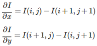

可以导出Roberts在点(i+1/2,j+1/2)处的水平与竖直边缘检测卷积核为：

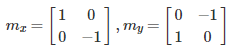

### Prewitt算子

Prewitt利用周围邻域8个点的灰度值来估计中心的梯度，它的梯度计算公式如下：

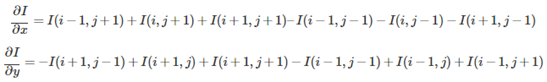

所以，Prewitt的卷积核为：

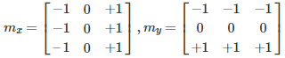

### Sobel算子

比起Prewitt算子，Sobel也是用周围8个像素来估计中心像素的梯度，但是Sobel算子认为靠近中心像素的点应该给予更高的权重，所以Sobel算子把与中心像素4邻接的像素的权重设置为2或-2。

Sobel边缘检测算子的卷积核为：

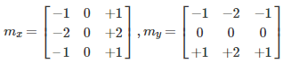

### Canny算法

Canny边缘检测实际上是一种一阶微分算子检测算法，增加了非最大值抑制和双阈值两项改进。利用非极大值抑制不仅可以有效地抑制多响应边缘，而且还可以提高边缘的定位精度；利用双阈值可以有效减少边缘的漏检率。

Canny边缘检测主要分四步进行：（1）去噪声；（2）计算梯度与方向角；（3）非最大值抑制；（4）滞后阈值化。

 

在上述的四种方法中，Canny算法的检测效果最好，可以精确定位，但是复杂度较高，Sobel算子尽管精度略低于Canny算法，但复杂度较低，检测效率较高，由于要部署在嵌入式开发平台上，考虑部署复杂度，检测效率和开发板资源，最后选择Sobel算子实现边缘检测。

## 系统设计

如所示，系统整体分为3个部分，首先图像输入，由型号OV5640的摄像头采集图像，图像输入到Zynq7000 AX7020开发板中进行图像边缘检测处理，处理完后的图像，在LCD显示屏上进行显示。下面，将针对系统每个部分进行详细说明。

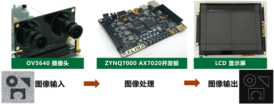

### 系统架构

由OV5640摄像头进行视频输入，数据经AXI4-Stream Subset
Converter于 edge_detector模块（自定义IP）中对摄像头视频进行边缘检测处理，VDMA1将AXI-Stream数据流写入DDR3，通过axi interconnect连接两个VDMA IP，VDMA0再从DDR3读取数据，通过AXI-Stream流接口连接到axi4s_vid_out IP并输出驱动信号给 LCD液晶屏模块显示图像。该系统中使用 v_tc IP来控制输出的显示格式和分辨率的时序控制，使用axi_dynclk IP来产生LCD屏的像数显示时钟信号。系统框图如下所示：

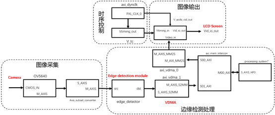

还增加了背光的PWM调节模块，用于调节背光亮度。

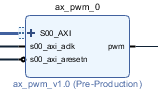

总的工程图如下所示：

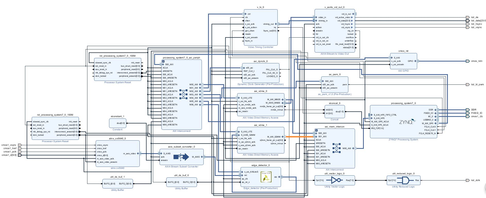

其中，alinx_ov5640 模块是自定义IP，作用是将摄像头输入的RGB565 转换成AX4-Stream 格式，其中包含一个cmos_8_16bit 模块，用来把8 位摄像头输入的数据转化为16 位RGB565格式，这时输出的RGB565
是2 个时钟周期一个像素，其中一个时钟周期是无用数据，另一个模块cmos_in_axi4s 是一个把摄像头的RGB565 数据转化为AXI4-Stream 的模块，这个模块的代码修改的xilinx 的“Video In to AXI4-Stream“这样一个IP，这个IP 输入是一个标准的视频格式，摄像头的RGB565 无法直接输入。对于AXI_VMDA1 的配置，只使能写通道，读通道不使能，VDMA缓冲区地址为8字节对齐。

### SDK代码分析

由于LCD显示屏的像素为800*480，需要在vga_modes.h文件中添加其时序参数，从而配置此参数给v_tc IP来产生正确的LCD屏驱动时序。

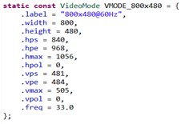

在用于显示的主程序文件中，首先进行sensor复位，摄像头和sensor初始化。

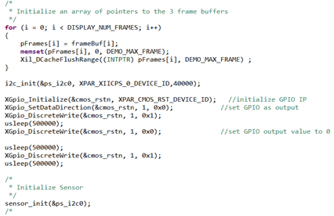

并配置PWM的频率和占空比，set_pwm_frequency第二个参数为基础时钟，Vivado中连接的是100MHz，第三个参数是要设置的PWM频率，单位为Hz。Set_pwm_duty第二个参数为占空比。

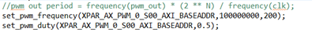

最后是edge_detector的处理和显示的设置。

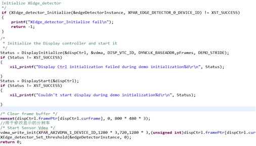

边缘检测模块主要代码：

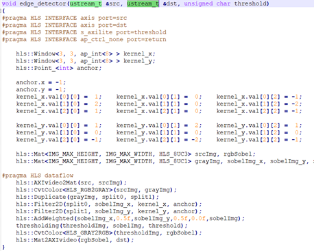

Threshold为将结果二值化的配置，为0时不进行二值化，其他值为二值化的阈值。先将rgb 图像转换为灰度图grayimg，将grayimg分成两份split0、split1分别进行水平和垂直方向的卷积运算，得到sobelimg_x和sobelimg_y，将它们叠加为sobelimg。然后将其二值化，转为RGB，输出。

## 结果展示

仿真测试结果如图所示：

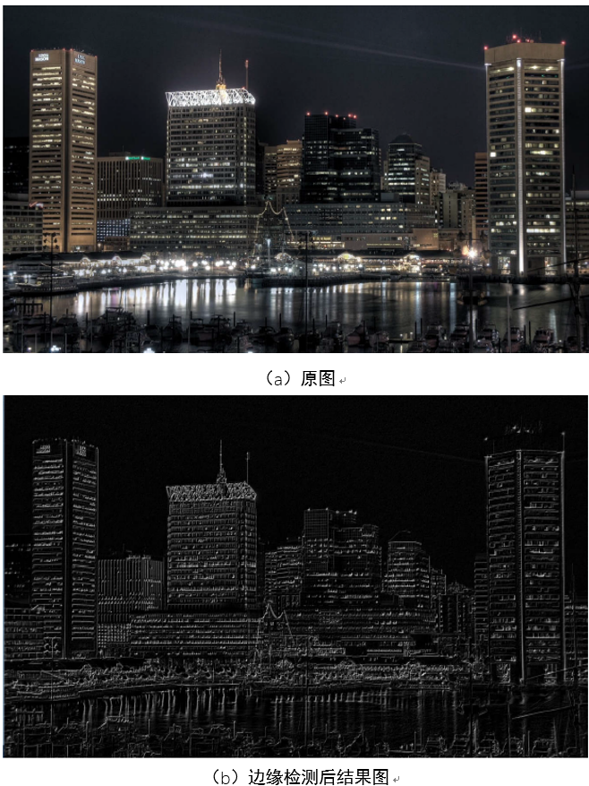

实际结果图如下图所示，分别为threshold为0和20进行边缘检测后的结果图。

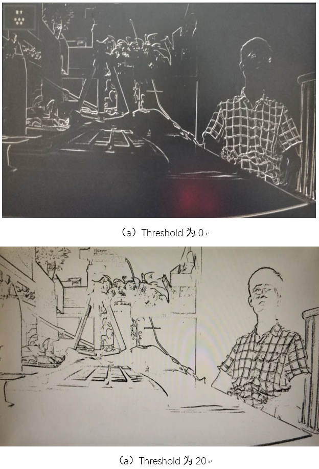

